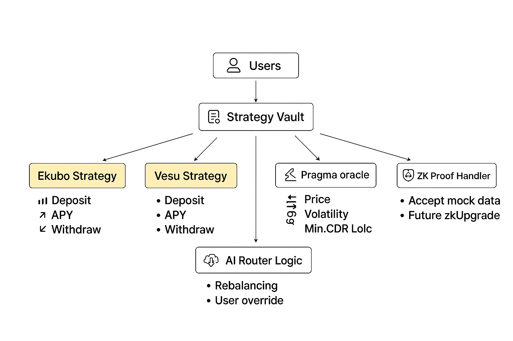

#  Syntheos VaultOS

**BTC Sovereign Modular Yield Vault on StarkNet**  
_Modular. Permissionless. AI-Powered. ZK-Ready. Powered by Pragma._

---

##  What is VaultOS?

**VaultOS** is the first fully modular, permissionless BTC yield vault on StarkNet.

-  **Modular Strategy Plugins** — Anyone can deploy a yield strategy and register it on-chain.
-  **AI-Powered Routing** — Real-time APY and risk data determines optimal yield source.
-  **ZK + Oracle + Risk Logic** — ZK-proof support (demo), live CDR monitoring with Pragma oracles.
-  **Dev-First Architecture** — Open IStrategy interface, plug-and-play components, extensible UI.

---

##  Key Features

 **Modular Architecture**  
→ Easily swap strategies like Ekubo or Vesu via plugin contracts.

 **AI Routing Engine**  
→ Simulates APY, volatility, and routes funds autonomously.

 **Live Oracle Integration (Pragma)**  
→ Real-time BTC/USD feed powers collateral ratio & risk metrics.

 **ZK-Proof Ready**  
→ Submit proof of balance without revealing amount (mocked for demo).

 **XP + Loyalty Tiers**  
→ Users earn XP per deposit, unlock yield boosts & gamified tiers.

 **Strategy Marketplace**  
→ View APYs, contract addresses, and developer docs for building your own.

---

##  Architecture Overview




### Components

-  **Vault Core** — Handles deposits/withdrawals and strategy routing.
-  **Strategy Plugins** — `IStrategy`-compliant modules (Ekubo, Vesu, etc.)
-  **AI Router** — Selects strategy based on APY, volatility, and risk.
-  **Pragma Oracle** — Feeds live BTC price + volatility to influence logic.
-  **ZK Proof Module** — (Mock) accepts proof of balance.
-  **Frontend UI** — Clean React app, real-time UX, XP tracker, AI routing.

---

##  Try It Yourself

```bash
git clone https://github.com/YOUR_GITHUB_USERNAME/syntheosvaultos.git
cd syntheosvaultos
npm install
npm run dev
```
##  Build Your Own Strategy
Anyone can plug in new strategies into VaultOS:

```
#[interface]
trait IStrategy {
    fn deposit(user: ContractAddress, amount: u256);
    fn withdraw(user: ContractAddress, amount: u256);
    fn get_user_balance(user: ContractAddress) -> u256;
    fn get_total_deposits() -> u256;
    fn get_simulated_apy() -> u256;
}
```
 Demo Highlights
- Live BTC Price + CDR tracking (Pragma)

- AI auto-switching Ekubo/Vesu based on volatility

- ZK proof input (accepts any string ending in VALID)

- Full APY history chart and XP-based user tiering

- Permissionless plugin registration for devs

## Prize Tracks
Prize	Why We Qualify
Best Use of Starknet	Modular contracts, AA-compatible, ZK support, on-chain registry, Cairo-native
Most Innovative Yield	AI-driven routing, open strategy market, live volatility signals
Build With Pragma	Oracle integration powers CDR & risk engine, volatility triggers AI switching
Commercial Potential	Loyalty tiers, extensible UI, developer SDK, high user retention model

## 🔗 Deployed Contracts (Starknet Sepolia)

| Contract         | Address                                                                 |
|------------------|-------------------------------------------------------------------------|
| Strategy Vault   | `0x05506962650e06cc50462e413e1789a07c738264dbf044f5368d9d1c279f30ac`    |
| Ekubo Strategy   | `0x024ea504835853c7777d32429bfe27b9ba35a0234af662ad0c001b6a38f80847`    |
| Vesu Strategy    | `0x013cf2bc5f41ccf8ed30413efaa7a433e02b1d19b8e0fb6f08309df3fa7a2509`    |
| MockBTC Token    | `0x03bb7c03134c566cdb352914fe4cb4f8383eaf8cf1556dd758a59ada849bb594`    |


Credits
Built by Nick Ng from Syntheos

Cairo v2 · Starknet · React + Tailwind · Pragma Oracle · Excalidraw

MIT License · 2025
Crafted for Starknet Hackathon 
